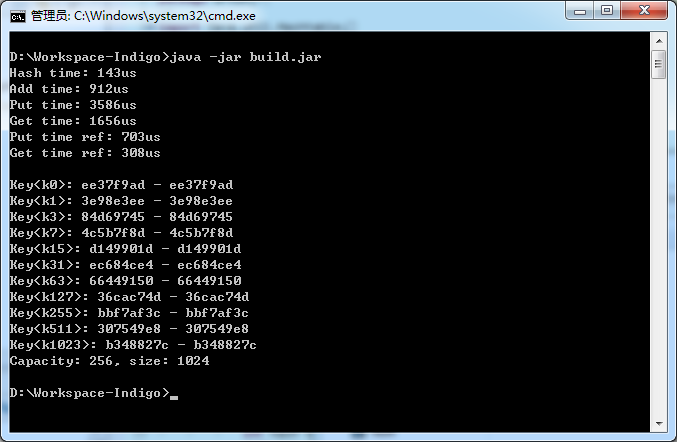
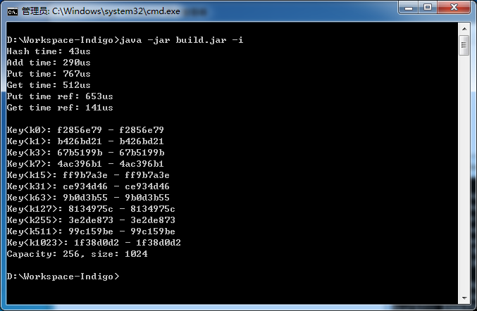

# KV Engine - step 0

`HashtableSimple`类

## 思路
本哈希表参考了官方API`Hashtable`的思路，主要依靠一个索引数组，配合链表处理相近/碰撞的哈希。不同的是增加了`add`方法，在基本能确保key值为新增时，不移除重复key，相比于`put`效率更高。

## 源码及截图
单Java文件`HashtableSimple.java`，与截图、jar包一并附于附件中。  
Git仓库：WRtux/CNSSKVEngine

## 改进
目前索引数组在构造时即确定，不会自动扩展，不够灵活。此外，相比于官方API，整体效率略低，这可能与索引数组大小和算法优化有关。
