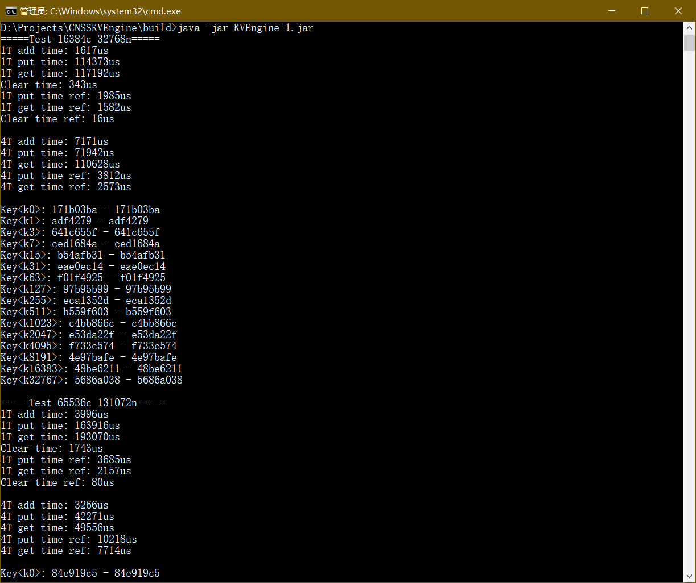

# KV Engine - step 1

`HashtableSimple`类实现了哈希表。  
`Tester`类用于测试性能。

## 概述
本哈希表参考了官方API`Hashtable`的思路，主要依靠一个索引数组，配合链表处理相近/碰撞的哈希。不同的是，增加了`add`方法，在基本能确保key值为新增时，不移除重复key，相比于`put`效率更高；采用了粒度较细的读写锁代替`synchronized`块，多线程混合读写时效率更高（未能在测试中体现）。此外，对于取哈希表大小之类采用了无锁结构，避免了阻塞。

### 并发性能
实际测试显示，在数据量较大时，并发`put`与`get`相比于单线程有明显的性能提升（而大`synchronized`块的性能则不如单线程，但API的效率还是更高）；`add`由于本身操作简单，提升不明显。而数据量较小时，并发操作的性能则难免不够好。

## 相关资源
相关资源一并附于附件中，也已上传至GitHub。  
GitHub仓库：WRtux/CNSSKVEngine

## 改进
目前索引数组在构造时即确定，不会自动扩展，不够灵活。此外，相比于step 0，由于锁的加入，效率又有所降低（即使有JIT优化），这可能与索引数组大小和算法优化有关。
